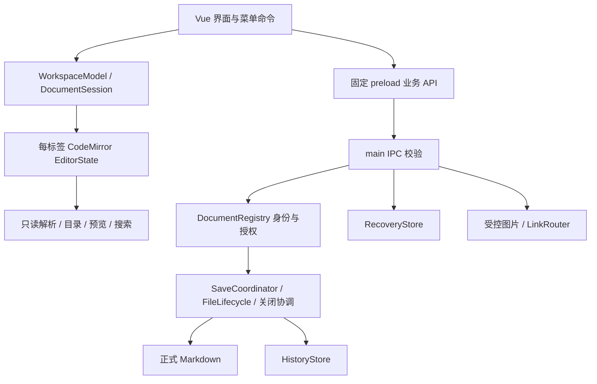

# InkNest 技术方案

本文说明应用的模块职责、状态所有权和数据流。产品约束见[需求](requirements.md)，功能边界见[已知限制](known-issues.md)。

## 技术组合

| 层 | 当前采用 | 边界 |
| --- | --- | --- |
| 桌面 | Electron 44.4.1 | 单实例、单窗口；系统能力集中 main |
| 界面 | Vue 3、TypeScript strict | 无 Node、无任意文件 API |
| 编辑 | CodeMirror 6 | 每文档一个 EditorState，只有活动 EditorView 挂载 |
| 预览 | markdown-it、DOMPurify | 共享 token 解析与受限扩展；高亮、Mermaid、KaTeX 按需加载 |
| 搜索 | @codemirror/search SearchCursor | 字面扫描；源码/净化正文分别适配，非第二份可写文档 |
| 图片 | sharp 元数据 + Chromium 展示 | 本地格式、像素、会话配额和能力 URL |
| 写入 | write-file-atomic | 库处理暂存/fsync/替换，业务负责版本核对和队列 |
| 构建/测试 | electron-vite、electron-builder、Vitest、Playwright Electron | 固定版本；真实系统验收单列 |

开发 Node 与 Electron 内嵌 Node 是不同运行时。精确工具链、传递依赖及许可见[依赖登记](dependencies.md)。本应用不引入服务器、数据库或云同步。

## 状态与模块所有权

`renderer/documents/session.ts` 持有源码、revision、编辑状态与保存基准；Vue 订阅派生状态，不能用另一个 v-model 全文覆盖 CodeMirror。`workspace.ts` 持有标签与每标签视图书签、错误和保存状态；`use-workspace.ts` 编排菜单、快照交换和调度。后台会话仍保存状态与独立调度，但不持续挂载正文 DOM。首页通过 renderer workspace 的 active=null 表达，保留全部会话，切换前结算 IME 并复核来源和冻结状态；不调用新建/打开/关闭接口，main 注册表继续维护后台会话。主进程激活事件可从首页定位到相关文档。

`main/documents/registry.ts` 管理 owner + docId + epoch、规范路径、dev/ino、磁盘 token、已接收快照及源/目标路径锁。主进程正文副本用于持久化和校验，不是第二个编辑来源。active 只决定显示/导航，不授权任意后台文件。

`SaveCoordinator` 管理快照、自动 slot、手动/生命周期屏障、最多 256 个完成请求及自身成功 token 链；`FileLifecycle` 管理外部重载/冲突/另存为；`CloseCoordinator` 与 `WorkspaceCloseCoordinator` 分别负责单文档确认和窗口全量释放。详细失败与时序见[持久化](persistence.md)。

## 打开与生命周期

main 启动即注册 open-file、单实例锁和 argv；`SystemOpenQueue` 合批 75ms 并串行交付。窗口创建共享 Promise，`document:renderer-ready` 在主题读取和 Vue 订阅完成后确认就绪。零个文件只唤起窗口，多文件通过主进程 picker 选择一个。

`readDocument` 验证类型、大小、真实路径、句柄身份/读前后版本与编码。`DocumentRegistry.open` 等已有写入稳定后读取候选，以规范路径或 dev/ino 去重；复用会话不重载正文，最多 20 标签。读取失败/取消保持既有文档；成功新会话安装目录监听。

父目录 watcher 合并事件；聚焦、激活及写前补核对。dirty 判断使用 renderer 冻结后的最新源码，不能因 checkpoint 尚未到达而覆盖新输入。接受外部磁盘版本会生成新 epoch 并撤销旧资源；普通切换/保存不清空撤销栈。路径大小写不能简单全部转小写。

## 解析、目录与资源

`parseDocument` 通过同一次 markdown-it token 解析生成不可信 HTML、ATX/Setext 标题与受限空 a 锚点元数据。目录 ID 为 `inknest-heading-N`；净化后才恢复应用生成 ID、有限链接索引和滚动容器。`anchor-map` 将标题 slug、同名后缀、直接 ID 和显式锚点映射到应用 ID，不开放文档任意 id/href。

`useOutline` 只协调当前正文/历史来源，150ms 合并解析并等待 IME；按标题层级和出现次序迁移折叠状态，歧义重置。编辑定位走原 EditorView 事务；>2MiB 纯文本不解析目录。

`ResourceService` 处理文档目录内被动图片及主动单文件能力；`image-metadata.ts` 使用 sharp 校验格式、帧数和像素。会话 URL 包含 docId/epoch/随机 resourceId，无可执行磁盘路径。`LinkRouter` 重新验证当前来源/代数并调用受限 shell 适配器：浏览器/邮件、目录打开、附件定位。没有额外目录授权方法，main 内的单文件能力不扩张根目录。

图片查看器 `ImageViewer.vue` 持有临时倍率、角度及适应状态；`preview/image-viewer.ts` 计算滚轮增量、倍率边界、旋转尺寸和坐标。旋转后的容器宽高负责滚动占位，内部原始 `img` 负责展示；缩放按帧合并并补偿锚点，切图/关闭撤销待处理帧和布局回调。资源 URL、原始图片和文档会话不参与这些展示状态变更。

`preview/extensions.ts` 只识别文档化的格式与折叠语法；任务、脚注等使用固定版本插件。`pipeline.ts` 在惰性模板中提取资源、表格对齐和脚注位置，净化后只恢复应用生成的类名、ID 与滚动控件。

`rich-content.ts` 在净化且挂载的 DOM 上按需绘制代码、公式与图表。KaTeX 生成再净化的 MathML，Mermaid 严格模式生成再净化的 SVG；样式限定在当前图表，使用窗口 nonce。图表全局队列串行，AbortSignal 和预览代数共同拒绝旧来源结果，卸载移除测量容器；无正文级永久缓存。这些库生成的显示结果不进入保存路径，容量与降级见 [Markdown 兼容性](markdown.md)。

## 搜索、历史与演示展示

搜索由 `use-document-search.ts` 按来源维护查询和取消代数。阅读适配对净化后的正文 Text 节点建立索引，CSS Custom Highlight 不改正文 DOM；编辑适配读取原 EditorState，使用可见范围 Decoration。匹配坐标存紧凑数组，扫描分段让出事件循环；完整计数不靠截断结果完成。

替换规划绑定不可变 Text/Matches、查询及来源版本，异步可取消；提交前复核，只通过原 CodeMirror ChangeSet 和容量过滤器写入。全部替换是一次独立撤销事件，正常推进 revision、自动保存和恢复，不重建编辑器。

历史侧栏和目录的开关按标签保存；当前最多持有一份历史正文。历史 HTML 仍经过同一安全管线，图片按当前正式路径解析，不存历史图片副本。REQ-028 受控还原是显式业务事务，普通预览绝不进入保存源。

`PresentationController` 归属 BrowserWindow，依 enter/leave-full-screen 事件或 10 秒看门狗核对状态；`usePresentation` 捕获已结算 IME 的只读快照，保留原模式/书签/系统全屏。演示有独立目录和滚动，原会话继续保存/恢复；来源失效则退出。受控测试事件不是原生验收。

## 主题与布局

main `ThemeStore` 管理 version1 `theme.json`，默认 system，手动只允许 light/dark；写入串行，损坏回退并在后续写入前保留损坏副本。renderer 按意图序号接纳响应，根级颜色统一过渡，不重建可写文档状态；只读预览仅替换图表输出，不重建基础正文、不重新授权图片，保留折叠区与图表查看方式；保存和撤销不受影响。

`panel-layout.ts` 管理 280/300px、30% 上限、960px 共存断点和对称留白；窄屏非模态并排。正文 scroll host 与 1080px 内容宽度分离。搜索浮层测量空间，显隐不改变工具栏几何。

## 文件与平台限制

UTF-8 可编辑文本在编辑器中为 LF，格式独立保留 BOM/LF/CRLF；非法编码、孤立 CR/混合换行、链接、权限和超限有只读路径。格式转换、通用 filesystem 分类、最近文件/窗口位置/阅读位置持久化尚未实现；相关类型字段不代表对应功能已开放。

保存检查到替换仍有跨进程竞态，不能承诺通用 CAS 或真实断电绝不丢失。当前只有 read/edit，扩展分屏或设置等能力时须同步需求与接口，不预先向 preload 暴露未实现接口。

## 无路径文档

REQ-009/013/014/015/026。DocumentRegistry.create 同步分配会话与递增显示名，不创建正式文件，不登记空路径或零指纹身份。无路径会话不参与目录监听及磁盘重载，写入锁只登记真实源/目标路径。原生保存建议使用本窗口最近成功打开/保存的目录，没有记录时使用系统文稿目录；该建议不授予写入权限。

首次保存复用 FileLifecycle / SaveCoordinator 的屏障、请求重放、目标核验及原子写入；目标目录的真实路径和 dev/ino 一并复查。成功后迁移原会话及资源、监测、恢复与历史关联，不重建 CodeMirror。renderer 对失联请求保留快照并冻结源编辑，原请求重试后接纳保存回执。

恢复调度除了正文 dirty，还追踪无路径会话是否尝试过备份；旧非空快照被清空时继续提交空快照。恢复列表验证最新空快照后隐藏该项，后续编辑仍沿原关联备份。单标签由 CloseCoordinator 完成未命名三选项及保存后续关；WorkspaceCloseCoordinator 保持整窗全部成功才释放的规则。
