# InkNest Markdown 完整展示 ✨

这份文档展示 [支持清单](../markdown.md) 中的全部内容。可以通过左侧目录逐项查看，也可以切换到编辑模式对照写法。示例只用于显示，不会执行其中的代码。

文档顶部的“文档元数据”默认折叠。图片位于同目录的 `assets` 文件夹，移动文档时请一起保留。

## 01 · 流程图与链接外观

流程图采用浅蓝圆角节点、蓝色文字、灰色连线和胶囊形连线标签。切换深色主题可以查看对应配色；“查看源码”“原始大小”和“复制”位于图表上方。

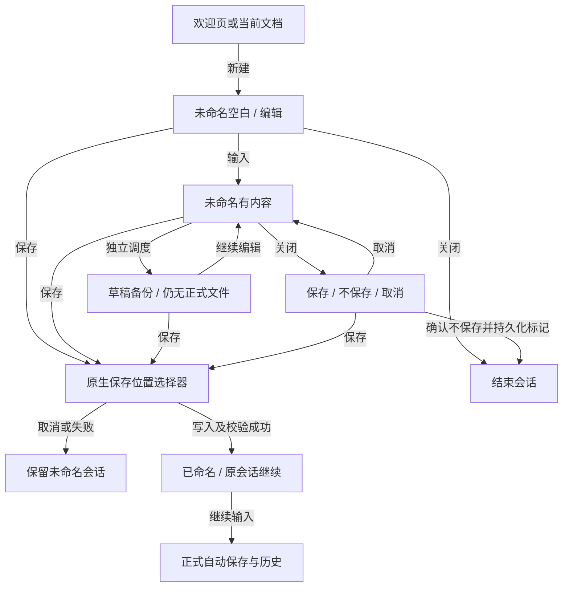

| 文档链接 | 内容 |
| --- | --- |
| [requirements.md](../requirements.md) | 产品需求与行为 |
| [interaction.md](../interaction.md) | 交互规则 |
| [markdown.md](../markdown.md) | Markdown 支持范围 |
| [本地链接目标](link-target.md) | 打开另一份样本文档 |

普通文字链接使用 **macOS Command / Windows Ctrl + 单击**。脚注和图片可直接单击。这里的颜色与正文、表格、引用中的链接保持一致。

## 02 · 基础 Markdown

### ATX 三级标题

#### ATX 四级标题

##### ATX 五级标题

###### ATX 六级标题

文档主标题及各章节分别展示了 ATX 一级、二级标题。

Setext 一级标题
================

这是下划线等号形式的标题。

Setext 二级标题
----------------

这是下划线短横线形式的标题。

### 段落与换行

这是第一个独立段落。中文、English、数字 123 和符号均保留。

这是第二个独立段落。**粗体**、*强调*、***粗体加斜体***，也可用 __另一种粗体__ 与 _另一种强调_。

软换行的第一行，
源码虽然换行，但仍属于同一段落。

硬换行的第一行，行尾使用反斜杠。\
这一行会明确另起一行。

转义字符：\*不是强调\*、\#不是标题、\[不是链接\]、\_下划线\_、\`反引号\`、\\反斜杠。

行内代码：`const count = 3`、`<div>保持字面文本</div>`、``包含 ` 反引号``。

下面是一条分隔线：

---

### 引用与嵌套列表

> 这是一段引用，包含 **重点** 和 [本地链接](link-target.md)。
>
> 第二段引用内容。
>
> > 这是嵌套引用。

- 无序列表第一项
  - 第二层第一项
  - 第二层第二项
    1. 混合嵌套有序列表
    2. 第二项
- 无序列表第二项

1. 有序列表第一项
   1. 第二层第一项
   2. 第二层第二项
      - 混合嵌套无序列表
2. 有序列表第二项

### 缩进与围栏代码

下面的两行使用四个空格缩进：

    const indented = "缩进代码块";
    console.log(indented);

波浪号也可作为围栏：

~~~text
这是一段纯文本围栏。
**不会加粗**，$x$ 不会变成公式。
~~~

## 03 · 表格、对齐与删除线

| 左对齐 | 居中 | 右对齐 |
| :--- | :---: | ---: |
| 文档名称 | 草稿 | 12 |
| **加粗**与 `code` | [链接](link-target.md) | 1024 |
| ~~已废弃~~ | 保留 | 3.14 |

删除线可以用于段落：~~旧方案~~ 已调整为 **新方案**。

下面的宽表格应只在表格内部横向滚动，不撑宽整个页面：

| 编号 | 第一列 | 第二列 | 第三列 | 第四列 | 第五列 | 第六列 | 第七列 | 第八列 |
| --- | --- | --- | --- | --- | --- | --- | --- | --- |
| 01 | markdown-preview-primary-layout | markdown-preview-secondary-layout | markdown-preview-tertiary-layout | markdown-preview-quaternary-layout | markdown-preview-resources-layout | markdown-preview-diagrams-layout | markdown-preview-footnotes-layout | markdown-preview-final-column |

## 04 · 只读任务列表

- [x] 已完成：查看基础排版
- [ ] 未完成：查看所有图表
- [ ] 父任务
  - [x] 已完成子任务
  - [ ] 未完成子任务

复选框仅展示源码中的状态。要改变勾选，请在编辑模式修改 `[ ]` 或 `[x]`。

## 05 · 链接与本地图片

### 各种链接写法

- [内联链接](link-target.md "本地示例目标")
- [引用式链接][sample-document]
- [省略标识的引用式链接][]
- [短引用]
- [显式网页链接](https://example.com/inknest)
- 裸网址：https://example.com/inknest
- 自动链接：<https://example.com/inknest>
- 裸邮箱：reader@example.com
- 邮箱自动链接：<reader@example.com>
- [邮箱链接](mailto:reader@example.com)
- [跳到标题锚点](#标题锚点目标)
- [跳到显式锚点](#sample-anchor)

[sample-document]: link-target.md "引用式链接目标"
[省略标识的引用式链接]: link-target.md
[短引用]: link-target.md

### 标题锚点目标

这是标题自动生成的锚点目标，点击上面的“跳到标题锚点”可以定位到这里。

<a id="sample-anchor"></a>

这是受限显式锚点 `sample-anchor` 的目标。独立行的空 `a` 标记只负责定位。

### PNG · 内联图片


### JPEG · 引用式图片

![JPEG 本地图片][sample-image]

[sample-image]: assets/showcase.jpg "JPEG 引用式图片"

### WebP · 本地图片


### GIF · 动图


单击图片可进入查看器。[本地图片文字链接](assets/showcase.png)也可直接单击；[带链接的图片](assets/showcase.jpg)指向另一张样本图。可以检查缩放、旋转、适应大小和 Esc 关闭。

## 06 · 代码高亮与复制

```typescript
interface DocumentInfo {
  title: string
  saved: boolean
}
const document: DocumentInfo = { title: '你好，InkNest', saved: true }
console.log(document.title)
```

```python
def greet(name: str) -> str:
    # 中文注释也能正常显示
    return f"你好，{name}"

print(greet("InkNest"))
```

```sql
SELECT title, updated_at
FROM documents
WHERE saved = TRUE
ORDER BY updated_at DESC;
```

未知语言保留纯文本，复制按钮仍复制原始内容：

```unknown-language
<document title="未知语言">
  **保持原文**，不执行任何程序。
</document>
```

更多常用语言的高亮示例在文末附录中，每种语言均有独立代码块。

## 07 · 数学公式的全部入口

美元分隔的行内公式：$E = mc^2$；括号分隔的行内公式：\(a^2 + b^2 = c^2\)。

双美元块公式：

$$
\int_0^1 x^2\,dx = \frac{1}{3}
$$

方括号块公式：

\[
\begin{pmatrix}
1 & 2 \\
3 & 4
\end{pmatrix}
\begin{pmatrix}x\\y\end{pmatrix}
= \begin{pmatrix}x+2y\\3x+4y\end{pmatrix}
\]

`math` 围栏公式：

```math
f(x)=\begin{cases}
x^2, & x\geq 0 \\
-x, & x<0
\end{cases}
```

更多 TeX 子集排版：

$$
\sum_{k=1}^{n} k = \frac{n(n+1)}{2}
\qquad
\lim_{x\to 0}\frac{\sin x}{x}=1
$$

金额 $5 和 $10 保持普通文本；转义美元 \$100，行内代码 `$x$` 也不会渲染为公式。

## 08 · 脚注与返回

第一次引用脚注[^reading]，这里再次引用同一脚注[^reading]，还可以引用另一条[^storage]。

脚注可直接单击或按 Enter/空格跳转，脚注末尾的返回链接回到对应引用。

[^reading]: 阅读提示：这条脚注包含 **粗体**、`行内代码` 和 [本地文档链接](link-target.md)。重复引用会显示多个返回入口。
[^storage]: 原始 Markdown 始终是保存内容，渲染后的图表和公式不会替换源码。

## 09 · 全部提示块

> [!NOTE]
> 说明：适合补充背景信息。

> [!TIP]
> 提示：使用左侧目录可以快速查看各章节。

> [!IMPORTANT]
> 重要：移动这份样本文档时，请一并保留 `assets` 文件夹。

> [!WARNING]
> 警告：这是样式展示，不代表发生了真实错误。

> [!CAUTION]
> 注意：任务列表的勾选状态需要在源码中修改。

## 10 · 文档元数据

当前文档使用 `---` 开头并以 `---` 结束的头部，显示在最上方默认折叠的“文档元数据”中。

另一种支持的写法以 `...` 结束，可打开 [元数据另一种结束写法](metadata-dots.md)查看实际效果。元数据只展示，不执行 YAML，也不改变应用设置。

## 11 · 定义列表、标记与上下标

Markdown
: 便于书写和阅读的纯文本标记格式。

未命名文档
: 尚未选定正式文件路径的文档。
: 可以继续编辑，也可以首次保存为 `.md` 文件。

Markdown 标记：==这段文字被高亮==。

Markdown 下标：H~2~O、CO~2~；Markdown 上标：x^2^、a^n^。

## 12 · Emoji

命名短码：:smile: :sparkles: :rocket: :white_check_mark: :warning:。

原有 Unicode Emoji：🙂 🌿 📚 🐈 🎉。

普通表情标点原样保留：:-) :D ;)。

## 13 · 少量 HTML 格式与折叠

`<br>` 换行：第一行<br>第二行。

`<br/>` 换行：第一行<br/>第二行。

键帽：<kbd>Command</kbd> + <kbd>S</kbd> / <kbd>Ctrl</kbd> + <kbd>S</kbd>。

HTML 下标：H<sub>2</sub>O；HTML 上标：x<sup>2</sup>；HTML 标记：<mark>这是另一种高亮写法</mark>。

<details>
<summary>默认折叠：单击展开正文</summary>

这段内容在展开后显示。支持 **粗体**、[链接](link-target.md)和列表。

- 折叠区内第一项
- 折叠区内第二项

### 折叠区中的标题

通过左侧目录定位此标题时，会先展开折叠区。

</details>

<details open>
<summary>默认展开：可以单击收起</summary>

这段内容初始可见，使用的是 `<details open>`。**收起、展开不会改写文档。**

</details>

## 14 · Mermaid 其他图表类型

开头已展示流程图，下面继续展示清单中的其他 12 类图表。颜色可以承载分类含义，各种图型保留自身的符号。

### 时序图

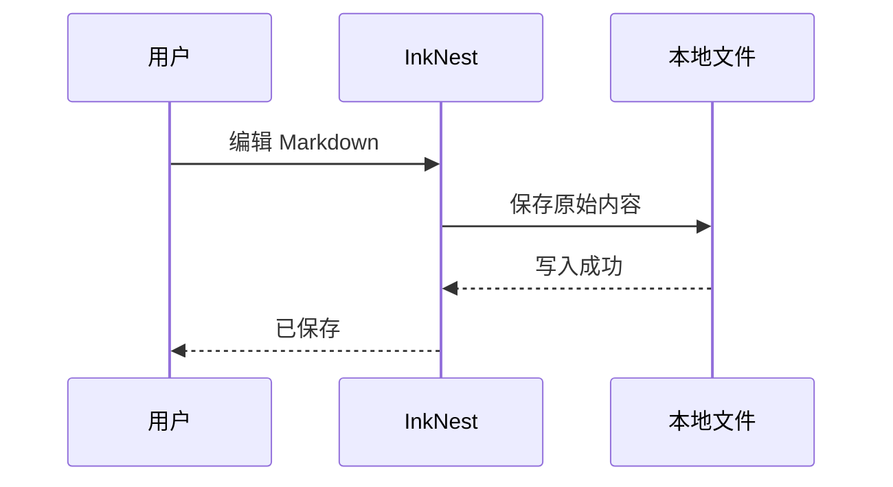

### 类图

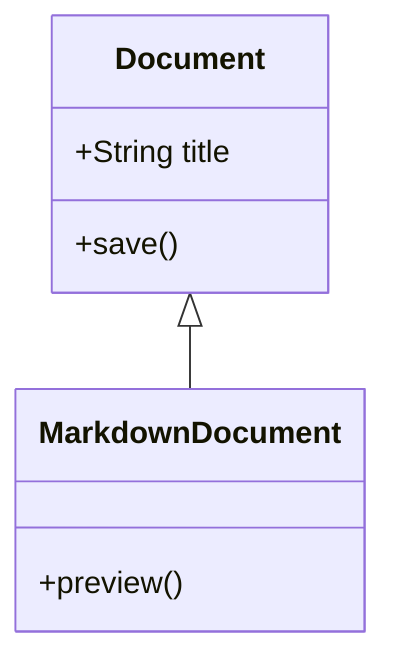

### 状态图

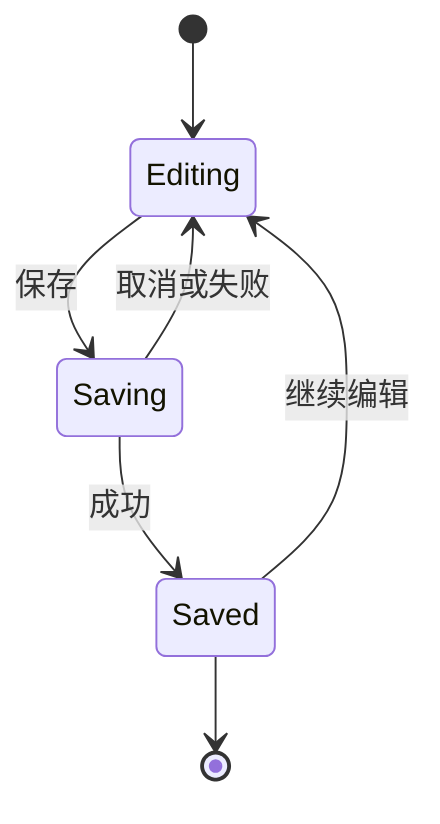

### 实体关系图

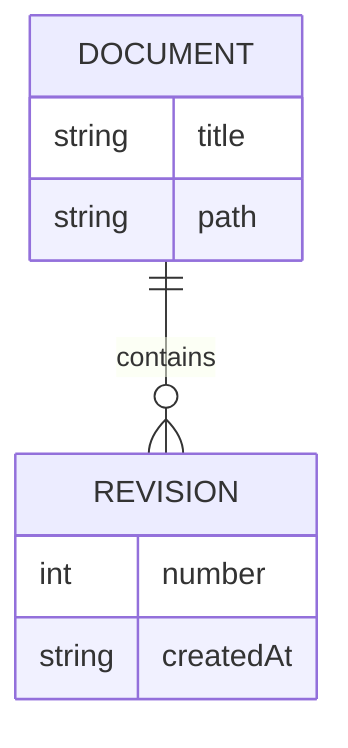

### 饼图

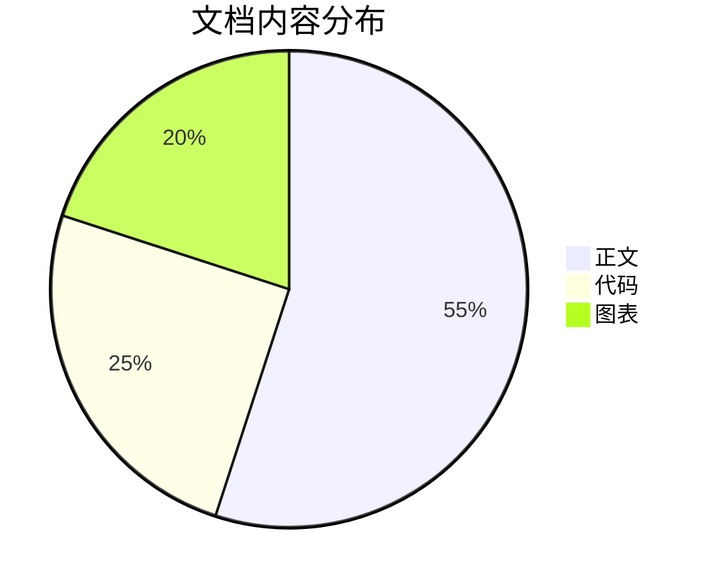

### 甘特图


### 思维导图

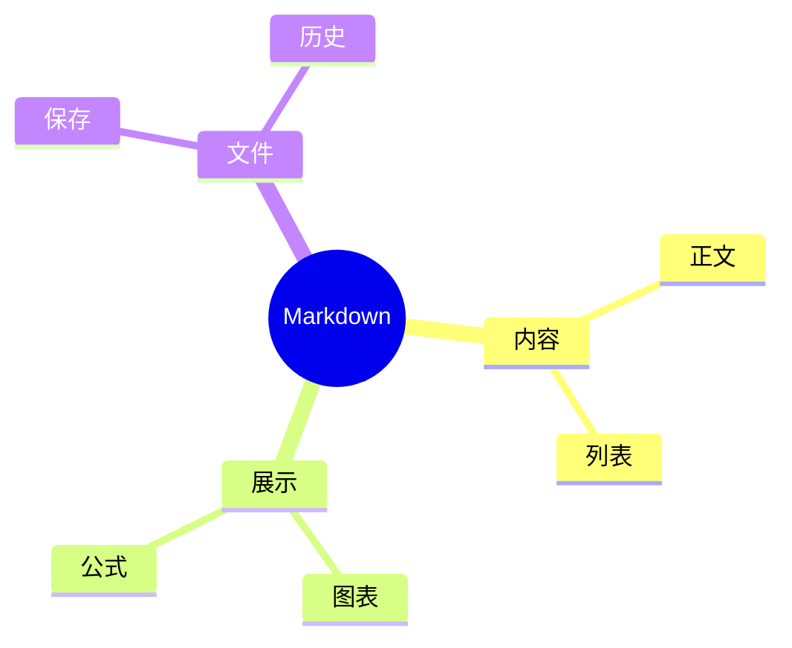

### 时间线

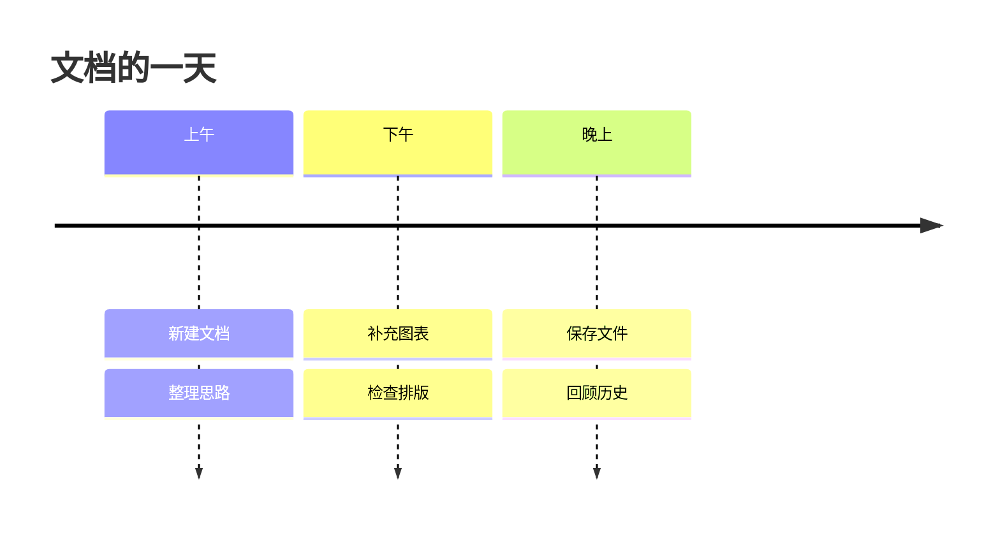

### Git 分支图

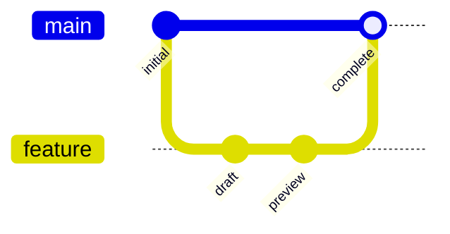

### 象限图

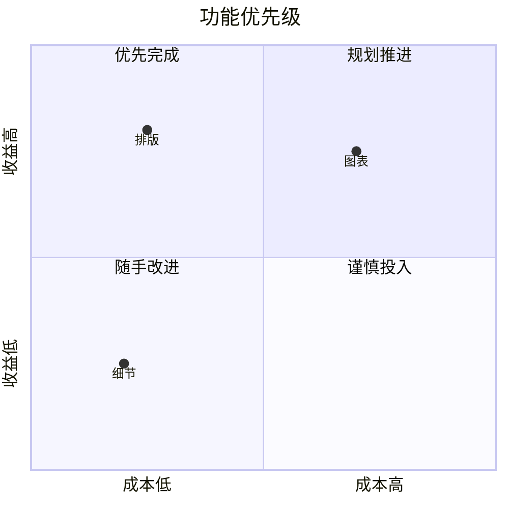

### XY 图

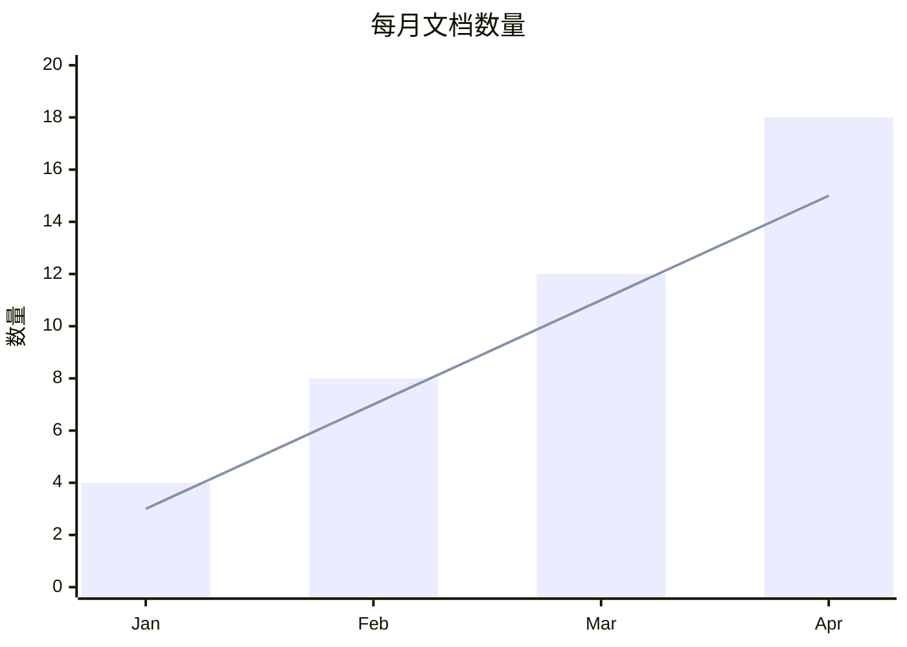

### 用户旅程

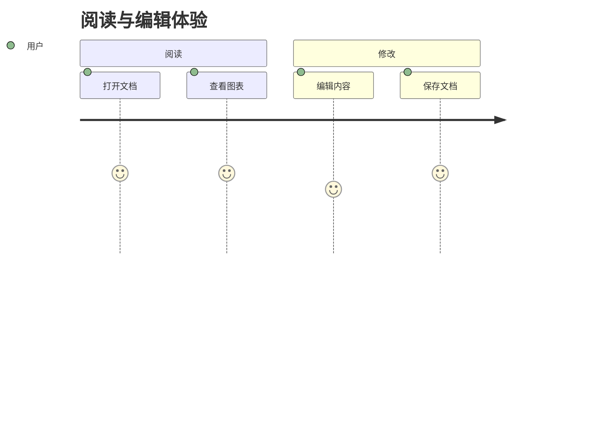

## 15 · 流程图形状与长标签

普通矩形会显示为圆角卡片；判断菱形、圆形、圆柱等符号保持原有含义。下面可同时检查这些形状、长文字和带标签的连线。

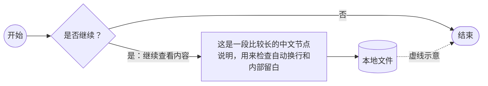

## 附录 A · 常用语言高亮

以下代码只用于展示，不会执行。每个代码块都可复制原始文本。

### xml

```xml
<article>
  <h1>你好，InkNest</h1>
</article>
```

### bash

```bash
name="InkNest"
printf "Hello, %s\n" "$name"
```

### c

```c
#include <stdio.h>
int main(void) { printf("Hello\n"); return 0; }
```

### cpp

```cpp
#include <string>
const std::string title = "InkNest";
```

### csharp

```csharp
public record Document(string Title, bool Saved);
```

### css

```css
.document { color: #339cff; border-radius: 18px; }
```

### markdown

```markdown
# 标题

**粗体**、[链接](https://example.com)
```

### diff

```diff
- oldTitle = "Draft"
+ newTitle = "Saved"
```

### ruby

```ruby
def greet(name)
  "Hello, #{name}"
end
```

### go

```go
package main
import "fmt"
func main() { fmt.Println("InkNest") }
```

### graphql

```graphql
query Documents { documents { id title saved } }
```

### ini

```ini
[document]
title=InkNest
saved=true
```

### java

```java
public record Document(String title, boolean saved) {}
```

### javascript

```javascript
const titles = ['草稿', '文档'].map(title => title.trim());
```

### json

```json
{ "title": "InkNest", "saved": true, "count": 3 }
```

### kotlin

```kotlin
data class Document(val title: String, val saved: Boolean)
```

### less

```less
@blue: #339cff;
.document { color: @blue; }
```

### lua

```lua
local title = "InkNest"
print(title)
```

### makefile

```makefile
preview:
	@echo "Markdown preview"
```

### perl

```perl
my $title = "InkNest";
print "$title\n";
```

### objectivec

```objectivec
@interface Document : NSObject
@property NSString *title;
@end
```

### php

```php
<?php
$title = "InkNest";
echo $title;
```

### php-template

```php-template
<h1><?= htmlspecialchars($title) ?></h1>
```

### plaintext

```plaintext
纯文本：**星号保留**，<tag>不会执行</tag>。
```

### python

```python
titles = ["草稿", "文档"]
print(len(titles))
```

### python-repl

```python-repl
>>> len("InkNest")
7
```

### r

```r
counts <- c(4, 8, 12)
mean(counts)
```

### rust

```rust
fn main() {
    let title = "InkNest";
    println!("{title}");
}
```

### scss

```scss
$blue: #339cff;
.document { color: $blue; &:hover { opacity: .8; } }
```

### shell

```shell
$ echo "InkNest"
InkNest
```

### sql

```sql
SELECT title FROM documents WHERE saved = TRUE;
```

### swift

```swift
struct Document {
    let title: String
    var saved: Bool
}
```

### yaml

```yaml
document:
  title: InkNest
  saved: true
```

### typescript

```typescript
type Mode = 'read' | 'edit'
const mode: Mode = 'read'
```

### vbnet

```vbnet
Dim title As String = "InkNest"
Console.WriteLine(title)
```

### wasm

```wasm
(module
  (func (export "answer") (result i32)
    i32.const 42))
```

## 附录 B · 语言别名与超长代码

`js`、`ts`、`html`、`sh` 等语言别名同样支持。

```js
const alias = "JavaScript 的 js 别名";
```

<details>
<summary>超长代码：展开查看纯文本降级与局部滚动</summary>

下面的 JavaScript 块超过 32,000 字符，按规则保持纯文本，不执行高亮；复制仍保留完整源码。

```javascript
// long-code-long-code-long-code-long-code-long-code-long-code-long-code-long-code-long-code-long-code-long-code-long-code-long-code-long-code-long-code-long-code-long-code-long-code-long-code-long-code-long-code-long-code-long-code-long-code-long-code-long-code-long-code-long-code-long-code-long-code-long-code-long-code-long-code-long-code-long-code-long-code-long-code-long-code-long-code-long-code-long-code-long-code-long-code-long-code-long-code-long-code-long-code-long-code-long-code-long-code-long-code-long-code-long-code-long-code-long-code-long-code-long-code-long-code-long-code-long-code-long-code-long-code-long-code-long-code-long-code-long-code-long-code-long-code-long-code-long-code-long-code-long-code-long-code-long-code-long-code-long-code-long-code-long-code-long-code-long-code-long-code-long-code-long-code-long-code-long-code-long-code-long-code-long-code-long-code-long-code-long-code-long-code-long-code-long-code-long-code-long-code-long-code-long-code-long-code-long-code-long-code-long-code-long-code-long-code-long-code-long-code-long-code-long-code-long-code-long-code-long-code-long-code-long-code-long-code-long-code-long-code-long-code-long-code-long-code-long-code-long-code-long-code-long-code-long-code-long-code-long-code-long-code-long-code-long-code-long-code-long-code-long-code-long-code-long-code-long-code-long-code-long-code-long-code-long-code-long-code-long-code-long-code-long-code-long-code-long-code-long-code-long-code-long-code-long-code-long-code-long-code-long-code-long-code-long-code-long-code-long-code-long-code-long-code-long-code-long-code-long-code-long-code-long-code-long-code-long-code-long-code-long-code-long-code-long-code-long-code-long-code-long-code-long-code-long-code-long-code-long-code-long-code-long-code-long-code-long-code-long-code-long-code-long-code-long-code-long-code-long-code-long-code-long-code-long-code-long-code-long-code-long-code-long-code-long-code-long-code-long-code-long-code-long-code-long-code-long-code-long-code-long-code-long-code-long-code-long-code-long-code-long-code-long-code-long-code-long-code-long-code-long-code-long-code-long-code-long-code-long-code-long-code-long-code-long-code-long-code-long-code-long-code-long-code-long-code-long-code-long-code-long-code-long-code-long-code-long-code-long-code-long-code-long-code-long-code-long-code-long-code-long-code-long-code-long-code-long-code-long-code-long-code-long-code-long-code-long-code-long-code-long-code-long-code-long-code-long-code-long-code-long-code-long-code-long-code-long-code-long-code-long-code-long-code-long-code-long-code-long-code-long-code-long-code-long-code-long-code-long-code-long-code-long-code-long-code-long-code-long-code-long-code-long-code-long-code-long-code-long-code-long-code-long-code-long-code-long-code-long-code-long-code-long-code-long-code-long-code-long-code-long-code-long-code-long-code-long-code-long-code-long-code-long-code-long-code-long-code-long-code-long-code-long-code-long-code-long-code-long-code-long-code-long-code-long-code-long-code-long-code-long-code-long-code-long-code-long-code-long-code-long-code-long-code-long-code-long-code-long-code-long-code-long-code-long-code-long-code-long-code-long-code-long-code-long-code-long-code-long-code-long-code-long-code-long-code-long-code-long-code-long-code-long-code-long-code-long-code-long-code-long-code-long-code-long-code-long-code-long-code-long-code-long-code-long-code-long-code-long-code-long-code-long-code-long-code-long-code-long-code-long-code-long-code-long-code-long-code-long-code-long-code-long-code-long-code-long-code-long-code-long-code-long-code-long-code-long-code-long-code-long-code-long-code-long-code-long-code-long-code-long-code-long-code-long-code-long-code-long-code-long-code-long-code-long-code-long-code-long-code-long-code-long-code-long-code-long-code-long-code-long-code-long-code-long-code-long-code-long-code-long-code-long-code-long-code-long-code-long-code-long-code-long-code-long-code-long-code-long-code-long-code-long-code-long-code-long-code-long-code-long-code-long-code-long-code-long-code-long-code-long-code-long-code-long-code-long-code-long-code-long-code-long-code-long-code-long-code-long-code-long-code-long-code-long-code-long-code-long-code-long-code-long-code-long-code-long-code-long-code-long-code-long-code-long-code-long-code-long-code-long-code-long-code-long-code-long-code-long-code-long-code-long-code-long-code-long-code-long-code-long-code-long-code-long-code-long-code-long-code-long-code-long-code-long-code-long-code-long-code-long-code-long-code-long-code-long-code-long-code-long-code-long-code-long-code-long-code-long-code-long-code-long-code-long-code-long-code-long-code-long-code-long-code-long-code-long-code-long-code-long-code-long-code-long-code-long-code-long-code-long-code-long-code-long-code-long-code-long-code-long-code-long-code-long-code-long-code-long-code-long-code-long-code-long-code-long-code-long-code-long-code-long-code-long-code-long-code-long-code-long-code-long-code-long-code-long-code-long-code-long-code-long-code-long-code-long-code-long-code-long-code-long-code-long-code-long-code-long-code-long-code-long-code-long-code-long-code-long-code-long-code-long-code-long-code-long-code-long-code-long-code-long-code-long-code-long-code-long-code-long-code-long-code-long-code-long-code-long-code-long-code-long-code-long-code-long-code-long-code-long-code-long-code-long-code-long-code-long-code-long-code-long-code-long-code-long-code-long-code-long-code-long-code-long-code-long-code-long-code-long-code-long-code-long-code-long-code-long-code-long-code-long-code-long-code-long-code-long-code-long-code-long-code-long-code-long-code-long-code-long-code-long-code-long-code-long-code-long-code-long-code-long-code-long-code-long-code-long-code-long-code-long-code-long-code-long-code-long-code-long-code-long-code-long-code-long-code-long-code-long-code-long-code-long-code-long-code-long-code-long-code-long-code-long-code-long-code-long-code-long-code-long-code-long-code-long-code-long-code-long-code-long-code-long-code-long-code-long-code-long-code-long-code-long-code-long-code-long-code-long-code-long-code-long-code-long-code-long-code-long-code-long-code-long-code-long-code-long-code-long-code-long-code-long-code-long-code-long-code-long-code-long-code-long-code-long-code-long-code-long-code-long-code-long-code-long-code-long-code-long-code-long-code-long-code-long-code-long-code-long-code-long-code-long-code-long-code-long-code-long-code-long-code-long-code-long-code-long-code-long-code-long-code-long-code-long-code-long-code-long-code-long-code-long-code-long-code-long-code-long-code-long-code-long-code-long-code-long-code-long-code-long-code-long-code-long-code-long-code-long-code-long-code-long-code-long-code-long-code-long-code-long-code-long-code-long-code-long-code-long-code-long-code-long-code-long-code-long-code-long-code-long-code-long-code-long-code-long-code-long-code-long-code-long-code-long-code-long-code-long-code-long-code-long-code-long-code-long-code-long-code-long-code-long-code-long-code-long-code-long-code-long-code-long-code-long-code-long-code-long-code-long-code-long-code-long-code-long-code-long-code-long-code-long-code-long-code-long-code-long-code-long-code-long-code-long-code-long-code-long-code-long-code-long-code-long-code-long-code-long-code-long-code-long-code-long-code-long-code-long-code-long-code-long-code-long-code-long-code-long-code-long-code-long-code-long-code-long-code-long-code-long-code-long-code-long-code-long-code-long-code-long-code-long-code-long-code-long-code-long-code-long-code-long-code-long-code-long-code-long-code-long-code-long-code-long-code-long-code-long-code-long-code-long-code-long-code-long-code-long-code-long-code-long-code-long-code-long-code-long-code-long-code-long-code-long-code-long-code-long-code-long-code-long-code-long-code-long-code-long-code-long-code-long-code-long-code-long-code-long-code-long-code-long-code-long-code-long-code-long-code-long-code-long-code-long-code-long-code-long-code-long-code-long-code-long-code-long-code-long-code-long-code-long-code-long-code-long-code-long-code-long-code-long-code-long-code-long-code-long-code-long-code-long-code-long-code-long-code-long-code-long-code-long-code-long-code-long-code-long-code-long-code-long-code-long-code-long-code-long-code-long-code-long-code-long-code-long-code-long-code-long-code-long-code-long-code-long-code-long-code-long-code-long-code-long-code-long-code-long-code-long-code-long-code-long-code-long-code-long-code-long-code-long-code-long-code-long-code-long-code-long-code-long-code-long-code-long-code-long-code-long-code-long-code-long-code-long-code-long-code-long-code-long-code-long-code-long-code-long-code-long-code-long-code-long-code-long-code-long-code-long-code-long-code-long-code-long-code-long-code-long-code-long-code-long-code-long-code-long-code-long-code-long-code-long-code-long-code-long-code-long-code-long-code-long-code-long-code-long-code-long-code-long-code-long-code-long-code-long-code-long-code-long-code-long-code-long-code-long-code-long-code-long-code-long-code-long-code-long-code-long-code-long-code-long-code-long-code-long-code-long-code-long-code-long-code-long-code-long-code-long-code-long-code-long-code-long-code-long-code-long-code-long-code-long-code-long-code-long-code-long-code-long-code-long-code-long-code-long-code-long-code-long-code-long-code-long-code-long-code-long-code-long-code-long-code-long-code-long-code-long-code-long-code-long-code-long-code-long-code-long-code-long-code-long-code-long-code-long-code-long-code-long-code-long-code-long-code-long-code-long-code-long-code-long-code-long-code-long-code-long-code-long-code-long-code-long-code-long-code-long-code-long-code-long-code-long-code-long-code-long-code-long-code-long-code-long-code-long-code-long-code-long-code-long-code-long-code-long-code-long-code-long-code-long-code-long-code-long-code-long-code-long-code-long-code-long-code-long-code-long-code-long-code-long-code-long-code-long-code-long-code-long-code-long-code-long-code-long-code-long-code-long-code-long-code-long-code-long-code-long-code-long-code-long-code-long-code-long-code-long-code-long-code-long-code-long-code-long-code-long-code-long-code-long-code-long-code-long-code-long-code-long-code-long-code-long-code-long-code-long-code-long-code-long-code-long-code-long-code-long-code-long-code-long-code-long-code-long-code-long-code-long-code-long-code-long-code-long-code-long-code-long-code-long-code-long-code-long-code-long-code-long-code-long-code-long-code-long-code-long-code-long-code-long-code-long-code-long-code-long-code-long-code-long-code-long-code-long-code-long-code-long-code-long-code-long-code-long-code-long-code-long-code-long-code-long-code-long-code-long-code-long-code-long-code-long-code-long-code-long-code-long-code-long-code-long-code-long-code-long-code-long-code-long-code-long-code-long-code-long-code-long-code-long-code-long-code-long-code-long-code-long-code-long-code-long-code-long-code-long-code-long-code-long-code-long-code-long-code-long-code-long-code-long-code-long-code-long-code-long-code-long-code-long-code-long-code-long-code-long-code-long-code-long-code-long-code-long-code-long-code-long-code-long-code-long-code-long-code-long-code-long-code-long-code-long-code-long-code-long-code-long-code-long-code-long-code-long-code-long-code-long-code-long-code-long-code-long-code-long-code-long-code-long-code-long-code-long-code-long-code-long-code-long-code-long-code-long-code-long-code-long-code-long-code-long-code-long-code-long-code-long-code-long-code-long-code-long-code-long-code-long-code-long-code-long-code-long-code-long-code-long-code-long-code-long-code-long-code-long-code-long-code-long-code-long-code-long-code-long-code-long-code-long-code-long-code-long-code-long-code-long-code-long-code-long-code-long-code-long-code-long-code-long-code-long-code-long-code-long-code-long-code-long-code-long-code-long-code-long-code-long-code-long-code-long-code-long-code-long-code-long-code-long-code-long-code-long-code-long-code-long-code-long-code-long-code-long-code-long-code-long-code-long-code-long-code-long-code-long-code-long-code-long-code-long-code-long-code-long-code-long-code-long-code-long-code-long-code-long-code-long-code-long-code-long-code-long-code-long-code-long-code-long-code-long-code-long-code-long-code-long-code-long-code-long-code-long-code-long-code-long-code-long-code-long-code-long-code-long-code-long-code-long-code-long-code-long-code-long-code-long-code-long-code-long-code-long-code-long-code-long-code-long-code-long-code-long-code-long-code-long-code-long-code-long-code-long-code-long-code-long-code-long-code-long-code-long-code-long-code-long-code-long-code-long-code-long-code-long-code-long-code-long-code-long-code-long-code-long-code-long-code-long-code-long-code-long-code-long-code-long-code-long-code-long-code-long-code-long-code-long-code-long-code-long-code-long-code-long-code-long-code-long-code-long-code-long-code-long-code-long-code-long-code-long-code-long-code-long-code-long-code-long-code-long-code-long-code-long-code-long-code-long-code-long-code-long-code-long-code-long-code-long-code-long-code-long-code-long-code-long-code-long-code-long-code-long-code-long-code-long-code-long-code-long-code-long-code-long-code-long-code-long-code-long-code-long-code-long-code-long-code-long-code-long-code-long-code-long-code-long-code-long-code-long-code-long-code-long-code-long-code-long-code-long-code-long-code-long-code-long-code-long-code-long-code-long-code-long-code-long-code-long-code-long-code-long-code-long-code-long-code-long-code-long-code-long-code-long-code-long-code-long-code-long-code-long-code-long-code-long-code-long-code-long-code-long-code-long-code-long-code-long-code-long-code-long-code-long-code-long-code-long-code-long-code-long-code-long-code-long-code-long-code-long-code-long-code-long-code-long-code-long-code-long-code-long-code-long-code-long-code-long-code-long-code-long-code-long-code-long-code-long-code-long-code-long-code-long-code-long-code-long-code-long-code-long-code-long-code-long-code-long-code-long-code-long-code-long-code-long-code-long-code-long-code-long-code-long-code-long-code-long-code-long-code-long-code-long-code-long-code-long-code-long-code-long-code-long-code-long-code-long-code-long-code-long-code-long-code-long-code-long-code-long-code-long-code-long-code-long-code-long-code-long-code-long-code-long-code-long-code-long-code-long-code-long-code-long-code-long-code-long-code-long-code-long-code-long-code-long-code-long-code-long-code-long-code-long-code-long-code-long-code-long-code-long-code-long-code-long-code-long-code-long-code-long-code-long-code-long-code-long-code-long-code-long-code-long-code-long-code-long-code-long-code-long-code-long-code-long-code-long-code-long-code-long-code-long-code-long-code-long-code-long-code-long-code-long-code-long-code-long-code-long-code-long-code-long-code-long-code-long-code-long-code-long-code-long-code-long-code-long-code-long-code-long-code-long-code-long-code-long-code-long-code-long-code-long-code-long-code-long-code-long-code-long-code-long-code-long-code-long-code-long-code-long-code-long-code-long-code-long-code-long-code-long-code-long-code-long-code-long-code-long-code-long-code-long-code-long-code-long-code-long-code-long-code-long-code-long-code-long-code-long-code-long-code-long-code-long-code-long-code-long-code-long-code-long-code-long-code-long-code-long-code-long-code-long-code-long-code-long-code-long-code-long-code-long-code-long-code-long-code-long-code-long-code-long-code-long-code-long-code-long-code-long-code-long-code-long-code-long-code-long-code-long-code-long-code-long-code-long-code-long-code-long-code-long-code-long-code-long-code-long-code-long-code-long-code-long-code-long-code-long-code-long-code-long-code-long-code-long-code-long-code-long-code-long-code-long-code-long-code-long-code-long-code-long-code-long-code-long-code-long-code-long-code-long-code-long-code-long-code-long-code-long-code-long-code-long-code-long-code-long-code-long-code-long-code-long-code-long-code-long-code-long-code-long-code-long-code-long-code-long-code-long-code-long-code-long-code-long-code-long-code-long-code-long-code-long-code-long-code-long-code-long-code-long-code-long-code-long-code-long-code-long-code-long-code-long-code-long-code-long-code-long-code-long-code-long-code-long-code-long-code-long-code-long-code-long-code-long-code-long-code-long-code-long-code-long-code-long-code-long-code-long-code-long-code-long-code-long-code-long-code-long-code-long-code-long-code-long-code-long-code-long-code-long-code-long-code-long-code-long-code-long-code-long-code-long-code-long-code-long-code-long-code-long-code-long-code-long-code-long-code-long-code-long-code-long-code-long-code-long-code-long-code-long-code-long-code-long-code-long-code-long-code-long-code-long-code-long-code-long-code-long-code-long-code-long-code-long-code-long-code-long-code-long-code-long-code-long-code-long-code-long-code-long-code-long-code-long-code-long-code-long-code-long-code-long-code-long-code-long-code-long-code-long-code-long-code-long-code-long-code-long-code-long-code-long-code-long-code-long-code-long-code-long-code-long-code-long-code-long-code-long-code-long-code-long-code-long-code-long-code-long-code-long-code-long-code-long-code-long-code-long-code-long-code-long-code-long-code-long-code-long-code-long-code-long-code-long-code-long-code-long-code-long-code-long-code-long-code-long-code-long-code-long-code-long-code-long-code-long-code-long-code-long-code-long-code-long-code-long-code-long-code-long-code-long-code-long-code-long-code-long-code-long-code-long-code-long-code-long-code-long-code-long-code-long-code-long-code-long-code-long-code-long-code-long-code-long-code-long-code-long-code-long-code-long-code-long-code-long-code-long-code-long-code-long-code-long-code-long-code-long-code-long-code-long-code-long-code-long-code-long-code-long-code-long-code-long-code-long-code-long-code-long-code-long-code-long-code-long-code-long-code-long-code-long-code-long-code-long-code-long-code-long-code-long-code-long-code-long-code-long-code-long-code-long-code-long-code-long-code-long-code-long-code-long-code-long-code-long-code-long-code-long-code-long-code-long-code-long-code-long-code-long-code-long-code-long-code-long-code-long-code-long-code-long-code-long-code-long-code-long-code-long-code-long-code-long-code-long-code-long-code-long-code-long-code-long-code-long-code-long-code-long-code-long-code-long-code-long-code-long-code-long-code-long-code-long-code-long-code-long-code-long-code-long-code-long-code-long-code-long-code-long-code-long-code-long-code-long-code-long-code-long-code-long-code-long-code-long-code-long-code-long-code-long-code-long-code-long-code-long-code-long-code-long-code-long-code-long-code-long-code-long-code-long-code-long-code-long-code-long-code-long-code-long-code-long-code-long-code-long-code-long-code-long-code-long-code-long-code-long-code-long-code-long-code-long-code-long-code-long-code-long-code-long-code-long-code-long-code-long-code-long-code-long-code-long-code-long-code-long-code-long-code-long-code-long-code-long-code-long-code-long-code-long-code-long-code-long-code-long-code-long-code-long-code-long-code-long-code-long-code-long-code-long-code-long-code-long-code-long-code-long-code-long-code-long-code-long-code-long-code-long-code-long-code-long-code-long-code-long-code-long-code-long-code-long-code-long-code-long-code-long-code-long-code-long-code-long-code-long-code-long-code-long-code-long-code-long-code-long-code-long-code-long-code-long-code-long-code-long-code-long-code-long-code-long-code-long-code-long-code-long-code-long-code-long-code-long-code-long-code-long-code-long-code-long-code-long-code-long-code-long-code-long-code-long-code-long-code-long-code-long-code-long-code-long-code-long-code-long-code-long-code-long-code-long-code-long-code-long-code-long-code-long-code-long-code-long-code-long-code-long-code-long-code-long-code-long-code-long-code-long-code-long-code-long-code-long-code-long-code-long-code-long-code-long-code-long-code-long-code-long-code-long-code-long-code-long-code-long-code-long-code-long-code-long-code-long-code-long-code-long-code-long-code-long-code-long-code-long-code-long-code-long-code-long-code-long-code-long-code-long-code-long-code-long-code-long-code-long-code-long-code-long-code-long-code-long-code-long-code-long-code-long-code-long-code-long-code-long-code-long-code-long-code-long-code-long-code-long-code-long-code-long-code-long-code-long-code-long-code-long-code-long-code-long-code-long-code-long-code-long-code-long-code-long-code-long-code-long-code-long-code-long-code-long-code-long-code-long-code-long-code-long-code-long-code-long-code-long-code-long-code-long-code-long-code-long-code-long-code-long-code-long-code-long-code-long-code-long-code-long-code-long-code-long-code-long-code-long-code-long-code-long-code-long-code-long-code-long-code-long-code-long-code-long-code-long-code-long-code-long-code-long-code-long-code-long-code-long-code-long-code-long-code-long-code-long-code-long-code-long-code-long-code-long-code-long-code-long-code-long-code-long-code-long-code-long-code-long-code-long-code-long-code-long-code-long-code-long-code-long-code-long-code-long-code-long-code-long-code-long-code-long-code-long-code-long-code-long-code-long-code-long-code-long-code-long-code-long-code-long-code-long-code-long-code-long-code-long-code-long-code-long-code-long-code-long-code-long-code-long-code-long-code-long-code-long-code-long-code-long-code-long-code-long-code-long-code-long-code-long-code-long-code-long-code-long-code-long-code-long-code-long-code-long-code-long-code-long-code-long-code-long-code-long-code-long-code-long-code-long-code-long-code-long-code-long-code-long-code-long-code-long-code-long-code-long-code-long-code-long-code-long-code-long-code-long-code-long-code-long-code-long-code-long-code-long-code-long-code-long-code-long-code-long-code-long-code-long-code-long-code-long-code-long-code-long-code-long-code-long-code-long-code-long-code-long-code-long-code-long-code-long-code-long-code-long-code-long-code-long-code-long-code-long-code-long-code-long-code-long-code-long-code-long-code-long-code-long-code-long-code-long-code-long-code-long-code-long-code-long-code-long-code-long-code-long-code-long-code-long-code-long-code-long-code-long-code-long-code-long-code-long-code-long-code-long-code-long-code-long-code-long-code-long-code-long-code-long-code-long-code-long-code-long-code-long-code-long-code-long-code-long-code-long-code-long-code-long-code-long-code-long-code-long-code-long-code-long-code-long-code-long-code-long-code-long-code-long-code-long-code-long-code-long-code-long-code-long-code-long-code-long-code-long-code-long-code-long-code-long-code-long-code-long-code-long-code-long-code-long-code-long-code-long-code-long-code-long-code-long-code-long-code-long-code-long-code-long-code-long-code-long-code-long-code-long-code-long-code-long-code-long-code-long-code-long-code-long-code-long-code-long-code-long-code-long-code-long-code-long-code-long-code-long-code-long-code-long-code-long-code-long-code-long-code-long-code-long-code-long-code-long-code-long-code-long-code-long-code-long-code-long-code-long-code-long-code-long-code-long-code-long-code-long-code-long-code-long-code-long-code-long-code-long-code-long-code-long-code-long-code-long-code-long-code-long-code-long-code-long-code-long-code-long-code-long-code-long-code-long-code-long-code-long-code-long-code-long-code-long-code-long-code-long-code-long-code-long-code-long-code-long-code-long-code-long-code-long-code-long-code-long-code-long-code-long-code-long-code-long-code-long-code-long-code-long-code-long-code-long-code-long-code-long-code-long-code-long-code-long-code-long-code-long-code-long-code-long-code-long-code-long-code-long-code-long-code-long-code-long-code-long-code-long-code-long-code-long-code-long-code-long-code-long-code-long-code-long-code-long-code-long-code-long-code-long-code-long-code-long-code-long-code-long-code-long-code-long-code-long-code-long-code-long-code-long-code-long-code-long-code-long-code-long-code-long-code-long-code-long-code-long-code-long-code-long-code-long-code-long-code-long-code-long-code-long-code-long-code-long-code-long-code-long-code-long-code-long-code-long-code-long-code-long-code-long-code-long-code-long-code-long-code-long-code-long-code-long-code-long-code-long-code-long-code-long-code-long-code-long-code-long-code-long-code-long-code-long-code-long-code-long-code-long-code-long-code-long-code-long-code-long-code-long-code-long-code-long-code-long-code-long-code-long-code-long-code-long-code-long-code-long-code-long-code-long-code-long-code-long-code-long-code-long-code-long-code-long-code-long-code-long-code-long-code-long-code-long-code-long-code-long-code-long-code-long-code-long-code-long-code-long-code-long-code-long-code-long-code-long-code-long-code-long-code-long-code-long-code-long-code-long-code-long-code-long-code-long-code-long-code-long-code-long-code-long-code-long-code-long-code-long-code-long-code-long-code-long-code-long-code-long-code-long-code-long-code-long-code-long-code-long-code-long-code-long-code-long-code-long-code-long-code-long-code-long-code-long-code-long-code-long-code-long-code-long-code-long-code-long-code-long-code-long-code-long-code-long-code-long-code-long-code-long-code-long-code-long-code-long-code-long-code-long-code-long-code-long-code-long-code-long-code-long-code-long-code-long-code-long-code-long-code-long-code-long-code-long-code-long-code-long-code-long-code-long-code-long-code-long-code-long-code-long-code-long-code-long-code-long-code-long-code-long-code-long-code-long-code-long-code-long-code-long-code-long-code-long-code-long-code-long-code-long-code-long-code-long-code-long-code-long-code-long-code-long-code-long-code-long-code-long-code-long-code-long-code-long-code-long-code-long-code-long-code-long-code-long-code-long-code-long-code-long-code-long-code-long-code-long-code-long-code-long-code-long-code-long-code-long-code-long-code-long-code-long-code-long-code-long-code-long-code-long-code-long-code-long-code-long-code-long-code-long-code-long-code-long-code-long-code-long-code-long-code-long-code-long-code-long-code-long-code-long-code-long-code-long-code-long-code-long-code-long-code-long-code-long-code-long-code-long-code-long-code-long-code-long-code-long-code-long-code-long-code-long-code-long-code-long-code-long-code-long-code-long-code-long-code-long-code-long-code-long-code-long-code-long-code-long-code-long-code-long-code-long-code-long-code-long-code-long-code-long-code-long-code-long-code-long-code-long-code-long-code-long-code-long-code-long-code-long-code-long-code-long-code-long-code-long-code-long-code-long-code-long-code-long-code-long-code-long-code-long-code-long-code-long-code-long-code-long-code-long-code-long-code-long-code-long-code-long-code-long-code-long-code-long-code-long-code-long-code-long-code-long-code-long-code-long-code-long-code-long-code-long-code-long-code-long-code-long-code-long-code-long-code-long-code-long-code-long-code-long-code-long-code-long-code-long-code-long-code-long-code-long-code-long-code-long-code-long-code-long-code-long-code-long-code-long-code-long-code-long-code-long-code-long-code-long-code-long-code-long-code-long-code-long-code-long-code-long-code-long-code-long-code-long-code-long-code-long-code-long-code-long-code-long-code-long-code-long-code-long-code-long-code-long-code-long-code-long-code-long-code-long-code-long-code-long-code-long-code-long-code-long-code-long-code-long-code-long-code-long-code-long-code-long-code-long-code-long-code-long-code-long-code-long-code-long-code-long-code-long-code-long-code-long-code-long-code-long-code-long-code-long-code-long-code-long-code-long-code-long-code-long-code-long-code-long-code-long-code-long-code-long-code-long-code-long-code-long-code-long-code-long-code-long-code-long-code-long-code-long-code-long-code-long-code-long-code-long-code-long-code-long-code-long-code-long-code-long-code-long-code-long-code-long-code-long-code-long-code-long-code-long-code-long-code-long-code-long-code-long-code-long-code-long-code-long-code-long-code-long-code-long-code-long-code-long-code-long-code-long-code-long-code-long-code-long-code-long-code-long-code-long-code-long-code-long-code-long-code-long-code-long-code-long-code-long-code-long-code-long-code-long-code-long-code-long-code-long-code-long-code-long-code-long-code-long-code-long-code-long-code-long-code-long-code-long-code-long-code-long-code-long-code-long-code-long-code-long-code-long-code-long-code-long-code-long-code-long-code-long-code-long-code-long-code-long-code-long-code-long-code-long-code-long-code-long-code-long-code-long-code-long-code-long-code-long-code-long-code-long-code-long-code-long-code-long-code-long-code-long-code-long-code-long-code-long-code-long-code-long-code-long-code-long-code-long-code-long-code-long-code-long-code-long-code-long-code-long-code-long-code-long-code-long-code-long-code-long-code-long-code-long-code-long-code-long-code-long-code-long-code-long-code-long-code-long-code-long-code-long-code-long-code-long-code-long-code-long-code-long-code-long-code-long-code-long-code-long-code-long-code-long-code-long-code-long-code-long-code-long-code-long-code-long-code-long-code-long-code-long-code-long-code-long-code-long-code-long-code-long-code-long-code-long-code-long-code-long-code-long-code-long-code-long-code-long-code-long-code-long-code-long-code-long-code-long-code-long-code-long-code-long-code-long-code-long-code-long-code-long-code-long-code-long-code-long-code-long-code-long-code-long-code-long-code-long-code-long-code-long-code-long-code-long-code-long-code-long-code-long-code-long-code-long-code-long-code-long-code-long-code-long-code-long-code-long-code-long-code-long-code-long-code-long-code-long-code-long-code-long-code-long-code-long-code-long-code-long-code-long-code-long-code-long-code-long-code-long-code-long-code-long-code-long-code-long-code-long-code-long-code-long-code-long-code-long-code-long-code-long-code-long-code-long-code-long-code-long-code-long-code-long-code-long-code-long-code-long-code-long-code-long-code-long-code-long-code-long-code-long-code-long-code-long-code-long-code-long-code-long-code-long-code-long-code-long-code-long-code-long-code-long-code-long-code-long-code-long-code-long-code-long-code-long-code-long-code-long-code-long-code-long-code-long-code-long-code-long-code-long-code-long-code-long-code-long-code-long-code-long-code-long-code-long-code-long-code-long-code-long-code-long-code-long-code-long-code-long-code-long-code-long-code-long-code-long-code-long-code-long-code-long-code-long-code-long-code-long-code-long-code-long-code-long-code-long-code-long-code-long-code-long-code-long-code-long-code-long-code-long-code-long-code-long-code-long-code-long-code-long-code-long-code-long-code-long-code-long-code-long-code-long-code-long-code-long-code-long-code-long-code-long-code-long-code-long-code-long-code-long-code-long-code-long-code-long-code-long-code-long-code-long-code-long-code-long-code-long-code-long-code-long-code-long-code-long-code-long-code-long-code-long-code-long-code-long-code-long-code-long-code-long-code-long-code-long-code-long-code-long-code-long-code-long-code-long-code-long-code-long-code-long-code-long-code-long-code-long-code-long-code-long-code-long-code-long-code-long-code-long-code-long-code-long-code-long-code-long-code-long-code-long-code-long-code-long-code-long-code-long-code-long-code-long-code-long-code-long-code-long-code-long-code-long-code-long-code-long-code-long-code-long-code-long-code-long-code-long-code-long-code-long-code-long-code-long-code-long-code-long-code-long-code-
```

</details>
