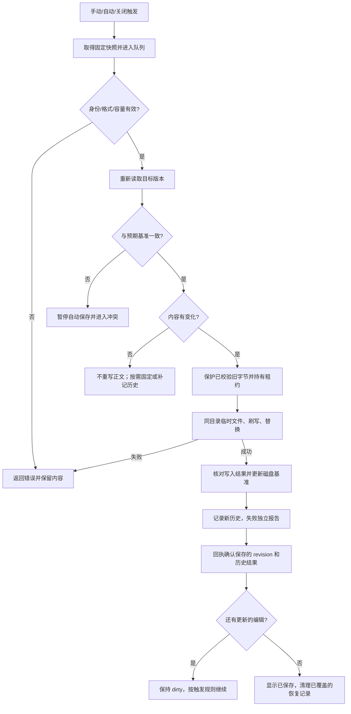

# 文档保存、冲突与恢复设计

关联 REQ-009 至 REQ-016、REQ-019、REQ-022/028，NFR-001。

## 1. 三种持久化

| 机制 | 目标位置 | 触发 | 用户看到的结果 |
| --- | --- | --- | --- |
| 正式保存 | 原文件或明确选定的新文件 | 手动 / 自动 / 关闭协调器 | 已保存或未保存、失败、冲突 |
| 恢复草稿 | userData/recovery | 独立防抖与最长等待调度 | 草稿已备份，不能等同正式保存 |
| 本地历史 | userData/history | 覆盖前保护；正式保存确认后立即记录 | 最新成功保存可见，自动组按60秒合并；可预览、导出及受控还原 |

正式保存关闭不影响恢复；恢复失败不自动改成向原文件保存。历史不是无限版本管理。所有调度和容量使用 [需求文档](requirements.md) 中的唯一默认值。

## 2. 必须成立的不变量

1. 任何正式写入都绑定不可变快照 `(docId, epoch, revision, text, format)`。
2. 同一规范目标文件只存在一个应用内写入执行者；不允许绕过保存协调器直接调用写文件。
3. 文档未改变时普通保存不重写原文件；dirty 不能单看 revision。
4. 保存成功只确认对应快照，不能确认更晚的编辑。
5. 保存失败、冲突或原文件丢失，内存内容和最后完整恢复快照不得被清空。
6. 未命名文档不会自行挑选路径，也不会把恢复路径当正式文件路径。
7. “丢弃”不回滚已成功保存的内容；“恢复”不静默覆盖原文件。
8. 所有成功写入均可追溯到 requestId、revision 与结果 token；日志不包含正文。

## 3. 正式保存流程

执行细节：

- 主进程从会话获取真实路径和格式，不能接受 renderer 自行指定任意写入位置。
- 入队时验证 revision 和大小；真正执行前再次验证文件身份及目标字节 hash。stat 仅作辅助。
- 序列化按已识别的 UTF-8/BOM/EOL 生成字节，不能将经过 DOMPurify 的 HTML 保存为文档。
- 使用同目录临时文件，保证替换不跨卷；保留原文件必要权限，不声称保留所有 ACL/xattr。Windows NTFS 权限继承和共享锁行为需在原生环境测试。
- 临时文件完整写入并执行库支持的 fsync 后替换；支持的系统执行必要目录刷写。不同系统持久性不同，不承诺硬件故障下的绝对保证。
- 原子替换前原文件保持完整；替换后以完整新内容为目标。禁止失败后回退为“先清空原文件再写”。
- 权限不足、磁盘满或 FILE_BUSY 返回失败；当前没有业务层 100ms / 300ms 定时重试。用户可明确重试，重试仍重新核对版本，不自动覆盖外部冲突。
- 替换后核对目标内容和身份；若与写入快照不符，则视为立即发生的外部变化，保留快照并显示冲突，不能继续标记已保存。
- 后置恢复记录清理失败不撤销已经成功的正式保存；保留安全多余副本并提示维护失败。
- 写入库在捕获异常与正常退出时尽力清理自己的临时文件；SIGKILL 可能留下临时文件。应用没有启动扫描清理或临时文件归属索引，不删除相似后缀文件。

检查到替换之间仍存在第三方进程竞争，Node / 普通文件系统 API 无法提供通用比较并交换事务。产品承诺是尽力发现变化、停止自动覆盖并保留内容，不承诺与任意第三方写入完全隔离。

## 4. 排队、合并和快照

队列按规范目标串行。尚未执行的多个自动保存可合并为最新快照，并让被合并的旧请求明确得到cancelled（不是成功回执）；手动保存和关闭保存是屏障，不静默丢掉用户动作。每文档最多一个自动请求进行中、一个最新待处理快照；手动和关闭屏障不能被跳过。

同一会话内，A 保存时产生 B：A 成功只推进正式基准到 A；当前 B 仍 dirty。B 入队时的 expectedDiskToken 可能还是 A 保存前的 token：只有主进程能够证明 token 变化完全来自本会话按序成功的保存，才把 B 的预期基准沿自身写入链推进；若中间出现外部变化则中断，不把任意旧 token 当有效。

用户在保存中撤销为磁盘旧内容，仍要根据最终当前内容与最终正式基准计算 dirty。不得仅因 revision 变大就持续显示未保存，也不得因收到任意成功回执就清除标记。

## 5. 自动保存状态机

| 事件 | 动作 |
| --- | --- |
| 内容变化 | 启动 1000ms 空闲计时，首次未保存修改启动 10000ms 最长等待 |
| 继续输入 | 重置空闲计时，不重置最长等待 |
| 中文组合输入进行中 | 到期后标记待处理，等待 compositionend，不改写编辑区 |
| 手动保存 | 取消旧空闲计时，立即取得快照并进入同一队列 |
| 打开可编辑文档 | 默认开启调度；只有正文实际修改后计时，未命名只保持恢复 |
| 冲突、丢失或写入失败 | 停止自动重试，显示原因；用户解决或点击重试后恢复调度 |
| 切换阅读模式 | 取得最新快照请求保存，不等待写入即可显示内存预览 |

历史备份失败时自动保存暂停。手动保存可以通过明确提示选择仅本次继续保存并跳过历史，默认取消；必须显示本次无法保留旧版本。该确认由主进程处理，不向页面暴露长期跳过历史的开关。

## 6. 外部修改

父目录监测、窗口重新聚焦、标签激活、保存前检查均可触发核对。事件聚合后比较实际字节；不能通过“保存后500ms内忽略全部事件”来过滤自身写入。

重载判断必须使用renderer当前状态：收到变化事件后冻结编辑并捕获最新快照，调用reconcileExternal，由主进程核对；完成后解冻。不能因恢复备份尚未发送而把刚输入的内容当成干净状态覆盖。后台变化检查可以异步，但最终替换会话前的状态交换必须串行。

| 本地状态 | 磁盘变化 | 行为 |
| --- | --- | --- |
| 干净 | 内容相同、仅时间改变 | 更新辅助 stat 信息，不重载编辑器 |
| 干净 | 内容不同 | 核验新格式后重载并提示，重载属于新 epoch |
| dirty / 正在保存 | 内容不同且不是自身已确认快照 | 冻结后续写入，保留两份内容，进入冲突 |
| 任意 | 删除 / 改名后路径不可访问 | 保留内存，标记 missing，暂停写入，提供另存为 |
| 任意 | 暂时权限或读取失败 | 标记 unavailable，不将其误判为空文件 |

首版不主动追踪跨目录重命名；原路径消失就作为文件不可用处理。单实例第二次打开相同文件聚焦当前文档，不创建第二个可写副本。

冲突确认绑定具体磁盘版本。用户选择覆盖后磁盘再次改变，必须重新展示冲突；选择使用磁盘版本前，取消未执行保存并等待正在写入结果稳定，再校验和重载。

## 7. 另存为事务

1. 等待组合输入提交，冻结编辑，暂停自动保存，排空当前进行中的写入。
2. 显示保存位置选择器。取消则恢复旧会话与调度。
3. 目标与当前文件身份相同则转普通保存；若属于另一标签则返回TARGET_OPEN。不同目标由本次对话框授予写入意图。
4. 对已存在目标展示覆盖确认并捕获其 token；对不存在目标记录预期不存在。正式写入前若目标状态改变，重新提示。
5. 已有正式路径跨目录时提示相对资源基准将改变；不自动复制附件。
6. 采用同一安全写入流程。成功后才切换路径、格式基准、资源授权和 watcher；保持编辑历史与 docId/epoch。
7. 失败保留原正式路径与内容。恢复记录在更新索引成功之前不能丢弃旧条目。

现阶段写入库不能保证与第三方创建目标的全局互斥，已存在/不存在检查仍有竞争窗口，按第3节限制处理。

## 8. 恢复草稿协议

恢复写入采用新内容文件 + 原子 manifest 发布：先写新 snapshot、刷写、验证 hash，再替换 manifest，最后清理多余旧文件。保留最新两份已索引快照；新 manifest 发布前写入中断，仍以旧的完整 manifest 为准。当前读取入口只加载 manifest 的最新条目；若该条目已损坏，不自动降级到第二份快照，显示不可恢复。保留两份不代表已经实现损坏后的自动回退。

恢复内容包含文本、格式、原路径、基准 token、revision、时间和 hash。renderer 定期发送快照，主进程校验递增关系并落盘；成功后才发 backed-up 事件。已命名干净文档不重复保存正文；未命名空白文档不创建无意义恢复项。

启动时：

1. 验证 manifest schema、文件名、尺寸、hash 和丢弃标记。
2. 合法丢弃标记优先于更旧快照；损坏数据保留并拒绝恢复，不覆盖原文件。
3. 展示文件名、快照时间及“可能有未备份的最后修改”；不把快照时间当最后编辑时间。
4. 用户恢复时建立新 epoch，并比较磁盘当前 token。
5. 磁盘仍为基准版本：恢复为有未保存修改的会话，等待用户正式保存。
6. 磁盘已改变：进入冲突；原路径不存在：保留恢复内容并要求另存为；未命名：恢复为未命名文档。

正常保存成功只可清理 revision ≤已保存且内容已覆盖的恢复项；若恢复区已有更晚 revision，必须保留。无路径恢复会话后来保存成功，同时更新路径关联；新建及无路径恢复共用首次保存事务。

用户明确不保存或丢弃恢复：先原子写入 discarded 标记，确认成功后才释放会话/删除内容；标记写失败则提示重试，不能假装丢弃完成。

清理恢复记录默认仅针对非活跃会话；活跃未保存内容必须通过正常关闭/丢弃流程处理。达到全局容量的淘汰顺序与警示按需求执行，不静默删除活跃会话的唯一安全副本。

## 9. 历史协议

历史记录正式保存确认后的原始字节，同时在覆盖前保护已校验的旧字节。保护已有匹配必须重新核验大小/hash并处于保留期；缺失/损坏阻止正式写入，不能凭manifest放行。操作在现有目标写入锁内依次完成：保护旧内容并持有租约→原子写入/核验原文件→推进磁盘基准→记录新内容→恢复维护→回执，finally释放租约。

首次A→B为[B,A]；同会话同路径的自动组在固定60000ms内更新最新节点，59999ms合并、60000ms新建，后续输入不滑动起点。时钟回拨、新会话/epoch/路径、手动/关闭/另存/还原形成边界，标签切换不形成边界。连续同内容不重复；回到早期内容时保留A→B→A轨迹。干净手动保存仅固定最新自动节点，不重写Markdown；无历史且未修改时不创建记录或空目录；历史失败后的明确重试可补记。

每次替换写新UUID正文、校验、原子发布schema2索引，再清理旧正文；ID永不换正文。schema1严格读取并映射legacy，首次修改原子迁移，失败保留旧索引。schema2的snapshots最多100条，按数组提交顺序排列；retired最多1000条，持久登记已经从可见列表移除、等待校验删除的正文。清理成功后再发布retired索引；删除/维护发布失败重启可重试，绝不把新历史提交改报失败。未知孤立内容没有删除授权，仍计入物理配额。

全局200MiB及30天约束包含新旧正文暂时共存、孤立/删除失败字节；合并净增0条，不能在满100条时额外淘汰。每文件先取数组最旧可淘汰节点，再按时间比较不同文件候选，避免系统回拨打乱单文件顺序。当前覆盖前节点、还原/导出目标由租约保护；空间仍不足则报告失败，不绕过保护。清理历史与有效租约/还原互斥。

SaveReceipt.history独立报告recorded/unchanged/failed/skipped。覆盖前失败阻止写入，普通手动可原生默认取消确认仅本次跳过；auto/close/restore不能跳过。原文件已确认后历史失败保持正文已保存与原基准，主进程和renderer暂停后续auto，恢复草稿独立继续；明确手动成功解除。关闭时单独默认取消确认“仍然关闭（正文已保存）”，不伪造dirty。清理失败仅提示维护警告，继续按实际字节计费。

还原持有目标租约跨确认及两阶段：保存当前B成功但其历史失败返回preservedCurrent并停止写C；C已确认但历史失败返回restored附history.failed，不伪造diskUncertain、不回滚B。导出同样pin指定ID，不能随最新节点变化。generation只在可见索引变化时递增，事件携带ref、displayPath；同ref另存后的旧路径事件不覆盖新列表。

跨原文件和历史不是原子事务：原文件成功后、历史发布前崩溃可能留下新原文件和旧列表。重启只承认完整索引，不把孤立新正文当作成功节点。真实强杀与断电验证分别记录。

历史浏览为只读展示和原始字节导出，不替换当前编辑状态。REQ-028 提供受控还原：默认取消确认，复用写入屏障、版本核对和强制历史保护；保留当前 BOM、LF/CRLF，结尾换行以历史为准，序列化后再次验证 2MiB 限制。成功在原 CodeMirror 状态中形成可撤销的新修订。完整事务见第 14 节。

## 10. 故障注入清单

必须可在测试适配层暂停或失败：检查磁盘后、历史快照前后、临时写入中、替换前、替换后回执前、恢复内容写完但 manifest 未提交时、关闭协调等待时。

断进程测试和真正断电并不等价；文档与发布说明必须分别描述已验证的故障类别。

## 11. 原子写入与回执边界

`write-file-atomic@8.0.0` 负责同目录临时文件、文件 fsync、普通权限/所有者继承及 rename。应用在进入库前和 awaited `tmpfileCreated` 回调核对原字节及身份，记录临时文件 dev/ino；完成后复核目标字节 hash 与替换身份。POSIX 追加目录 fsync，Windows 不执行不可移植的目录打开。

库没有 rename 前的业务钩子，最后核对到 rename 之间仍有写入/fsync 窗口。目录刷写或回执前确认失败时，即使磁盘已有新版，也不能把未确认替换提升为成功 token 链；保持本地快照并等待核对。权限继承不等于完整保留 ACL/xattr。

ENOSPC/EACCES/EBUSY 注入验证的是错误边界；子进程 SIGKILL 验证进程中断。它们不是物理磁盘满、真实 Windows 共享锁或断电验收。

## 12. 有界准入、恢复维护与会话身份

手动、关闭和生命周期屏障排空此前接受的保存。屏障等待或执行时新 auto 返回 cancelled，不登记正文、不消耗 requestId；renderer 保留最新修改，解冻后重新调度。失败只暂停相应文件；suspend 保留正在提交的槽位，dispose 只用于会话移除、epoch 失效或卸载。

完成请求只保留最近 256 份规范 payload hash 和小型结果，不保留历史正文。未完成请求不被淘汰；同 UUID 不同操作类型或 payload 拒绝。成功项的 expectedToken 可作为有限的自身写入链证明，允许迟到回执期间连续手动保存；磁盘仍必须与 main 当前基准一致。失败/cancelled 不延长证明。另存迁移、明确覆盖及新 epoch 重载切断旧链；过期 requestId 不承诺结果重放。

恢复队列独立于正式写入。保存 A 期间可备份 B；afterSave 只清除已被 A 覆盖的修订，为剩余 B 更新正式路径/token。维护失败保留旧关联与安全冗余，不把 A 改报未保存。恢复内容沿原 entry 的 revision 续增；正式保存/丢弃按会话关联清理，不按相同路径误删另一会话。

恢复登记在队列外等待写入，进入队列后再核对身份与版本，变化时退出重试。不能持有恢复队列等待正式写入，否则与 afterSave 形成互锁。已经打开的目标只激活原会话，不能插入第二个可写会话。

恢复调度为 2000ms 空闲 / 10000ms 最长等待；只响应正文修订，等待组合输入提交。恢复待确认内容不自动写回；明确手动保存或用户后续真实编辑后才解除门控。恢复失败不抹去正式保存冲突。

记录拒绝链接、特殊文件、越界名、重复快照、未知字段和更高 schema。清理仅删除索引明确归属且大小/hash 校验通过的正文；损坏或孤立文件保留并计入物理配额。活跃恢复不过期，非活跃记录保留 30 天；20 会话、每会话两份、全局 100MiB。容量维护需要明确确认，删除后重算实际字节，不预扣尚未删除的快照。空间不足不能静默删除唯一活跃副本。

丢弃 marker 必须持久发布，且在恢复队列中复核用户确认的 ref/epoch/revision/text。晚 checkpoint 不匹配则取消；marker 发布后拒绝新 checkpoint。删除失败留下冗余但不复活草稿，后续列表/维护可重试已知内容回收。

## 13. 单标签关闭与整窗退出

单标签关闭等待组合输入，冻结最新快照，排空并保存后才释放会话。明确不保存使用默认取消的独立确认，持久写入对应版本的 discard marker 后释放；失败保留正文与恢复。

整窗先暂停所有自动计时、冻结全部会话，逐个核对并保存，全部维护完成后重新核对成员及确认快照，再统一释放。首个冲突、失败、恢复待确认或需另存为会取消退出并定位问题文档；已成功写入不回滚，所有标签保留。整窗没有批量丢弃。

原生生命周期对话框或历史还原进行中时取消本次关闭，让原操作继续。最新状态交换 5 秒无回复则取消，拒绝迟到响应；用户在原生确认中的等待不计入这个通信超时。取消关闭会恢复合格文档的调度，不清除更晚恢复稿。

## 14. 受控历史还原

还原在首次异步工作前登记本 ref 门控：此前接受的写入继续完成，后续同 ref 保存、另存为、外部重载、冲突处理和关闭被阻止；其他标签继续独立工作。还原与历史清理互斥，包含清理确认等待期。

主进程从当前规范路径的索引读取目标 ID，复核 owner/ref、字节 hash、可编辑格式、current 磁盘状态、恢复门控、最新 revision/正文、token 链和实际磁盘。UI 的 restorable 不是写入授权。逻辑正文相同时返回 unchanged，无确认、写入或新修订。

确认后再次核验全部条件。若磁盘为 A、当前内存 B 为 dirty、选中历史 C：先强制保护 A 并保存 B，再强制核验 B 历史，最后写 C。选中 C 跨确认及两阶段持有租约。B 已保存但其历史失败，返回 preservedCurrent 并停止写 C；C 已确认而后置历史失败，返回 restored 附独立警告。两次写入都不能跳过历史。

写后字节/身份确认成功，revision 推进为冻结修订 + 1；成功或写后无法确认均切断旧 token 证明。若替换可能已发生而结果不能确认，返回 diskUncertain，暂停自动保存，不盲目回滚。renderer 只接受被冻结且精确匹配的回执，在原 EditorState 提交隔离撤销事务；撤销还原可回 B，更早编辑历史仍保留。

回复失联时每工作区最多保留一个原还原操作与 capture，锁定源编辑并暂停该源自动保存、新历史正文读取。核对重发完全相同 requestId/payload，查询已有小型回执，不二次还原、不改 token 强行写入。已有回执查询仍验证来源与身份，但先于关闭准入；新还原不能借此越过关闭保护。终态、会话失效或卸载释放上下文。主进程持续不可达时源文档暂不能编辑，这是保留可核对结果的限制。

## 15. 新建、首次保存与空恢复快照

新建会话使用 UTF-8 无 BOM、LF，正文为空且没有磁盘 token；正式文件仅在用户选择保存位置后创建。空内容也可主动保存为零字节文件。首次保存复用另存为队列和原子校验，补齐扩展名后再解析最终目标；同目标与现有标签去重、覆盖保护、父目录身份复查全部保留，不登记共享空路径锁。

首存确认后保持 docId/epoch、编辑状态及撤销历史，建立路径、资源、目录监听和固定历史节点。正文成功与历史/恢复维护失败分别报告。IPC 结果失联时保留原请求和快照，冻结当前源编辑，原请求核对不能再次弹出选择器或重复写入。显式终态失败保持来源会话，重新尝试仍核对磁盘，不声称失败意味着从未写入。

从未输入且从未备份的空稿不生成记录。若已尝试提交或已成功备份非空稿，随后清空仍须提交空快照，不由 dirty=false 取消维护；发布失败显示备份错误。最新完整空快照不列为待恢复空白稿，不回退展示更旧非空正文；继续编辑可沿同一关联备份。关闭空稿须等待已接纳备份并按确认 revision 清理，失败保留标签；整窗后续取消仍能继续使用该恢复关联。

多个无路径恢复按记录 ID 独立登记，不能按空路径或零指纹去重。恢复到当前窗口分配新编号并进入编辑；编号不跨进程持久化，恢复列表以时间、预览和记录身份区分。恢复不保证最后未备份输入或跨进程撤销栈。
