# Markdown 兼容样本 :sparkles:

## 基础语法

**加粗**、*斜体*、~~删除~~、==标记==、H~2~O、x^2^、`行内代码`。

网址 https://example.com/inknest 与邮箱 reader@example.com。

| 左侧 | 居中 | 右侧 |
| :--- | :---: | ---: |
| 中文 | 内容 | 123 |

- [ ] 未完成
- [x] 已完成

> [!NOTE]
> 这是一条说明。

> [!WARNING]
> 这是一条警告。

术语
: 术语的解释。

<details>
<summary>展开补充说明</summary>

折叠正文中的关键词：折叠测试。

按 <kbd>Command</kbd> 保存。<br>这里换行。

</details>

脚注第一次[^explain]，再次引用[^explain]。

[^explain]: 这是脚注正文，包含 **强调**。

## 代码

```typescript
const greeting: string = '你好，InkNest'
console.log(greeting)
```

```unknown-language
<script>literal code</script>
```

## 公式

行内公式 $E = mc^2$，以及 \(a^2 + b^2 = c^2\)。

$$
\int_0^1 x^2\,dx = \frac{1}{3}
$$

\[
\begin{pmatrix}1 & 2 \\ 3 & 4\end{pmatrix}
\]

货币 $5 和 $10 不应被合并为公式。

## 图表

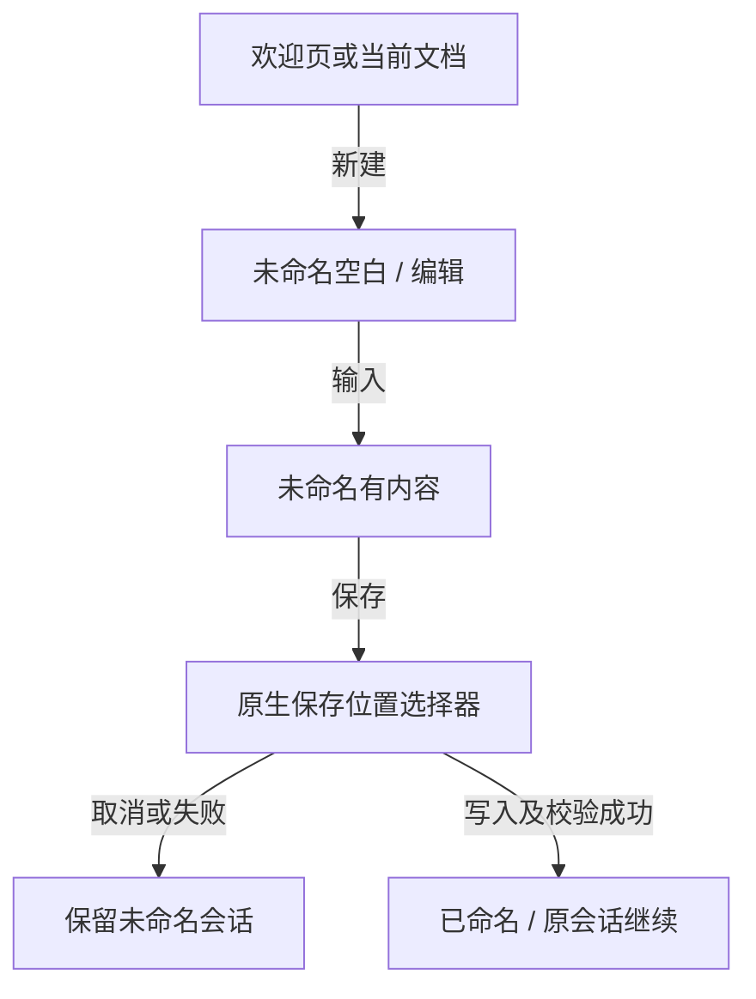

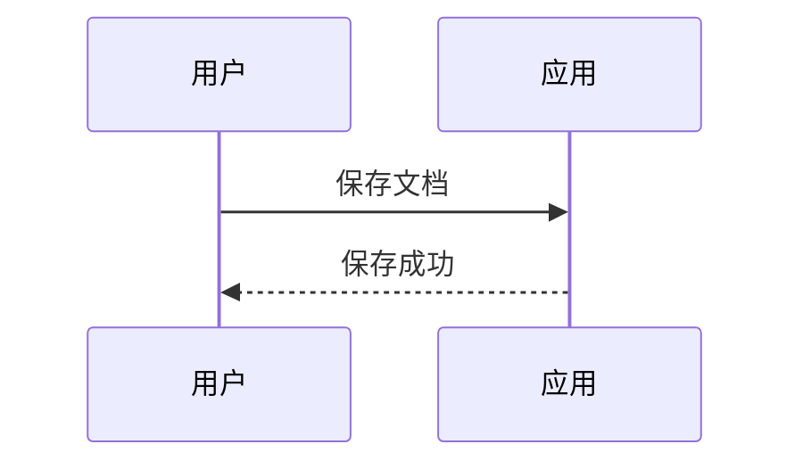

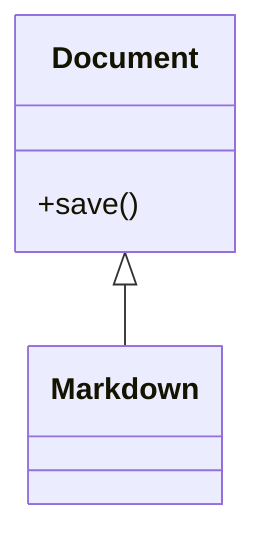

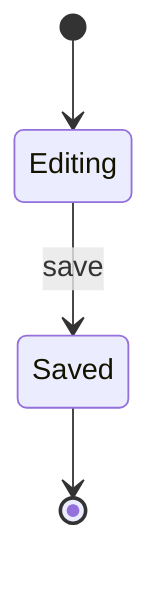

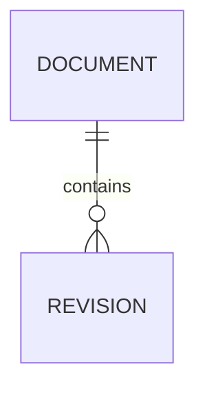

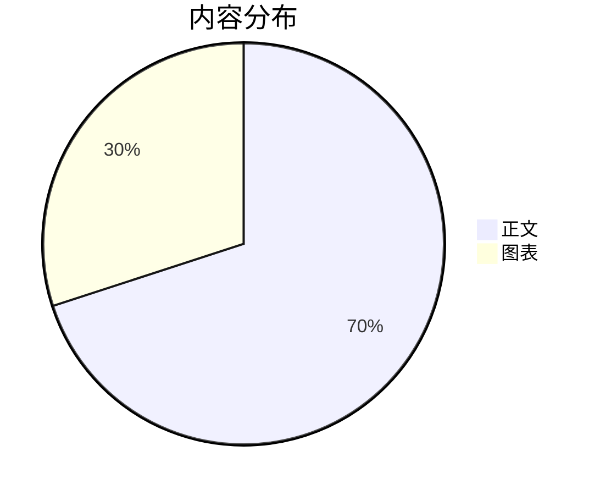

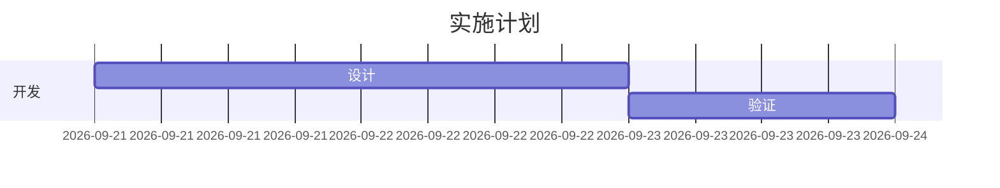

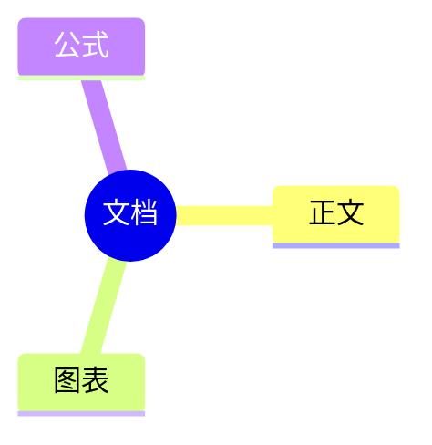

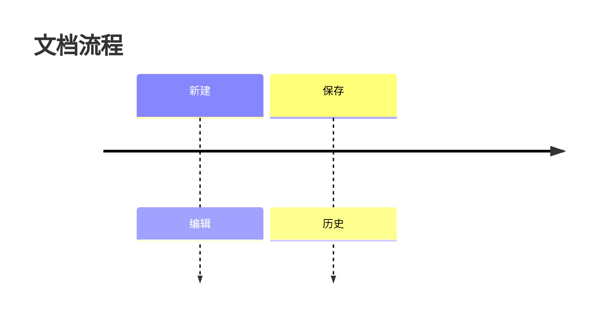

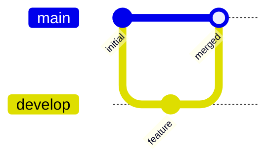

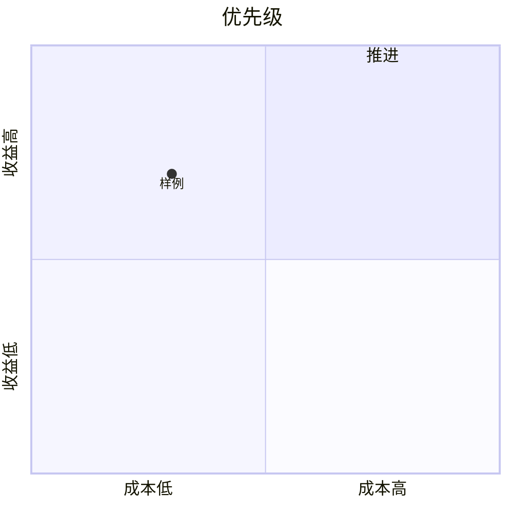

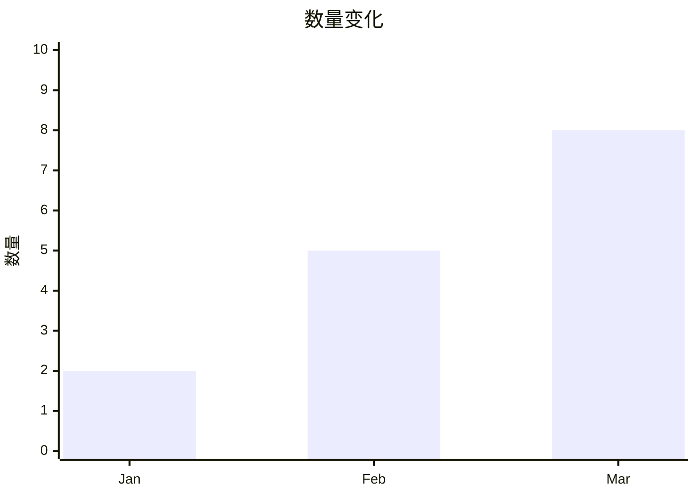

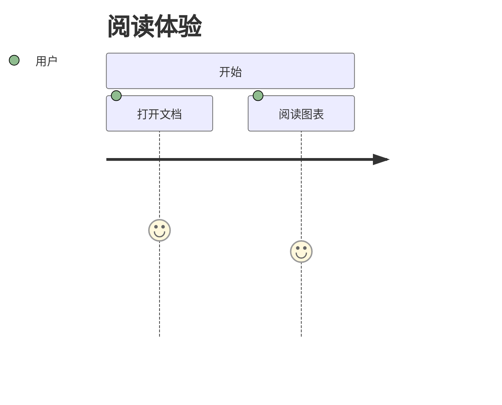

## 错误隔离

```mermaid
this is not a diagram
```

错误公式 $\notARealCommand{x}$ 后面的正文必须仍然显示。

原始脚本保持文字：<script>window.pwned = true</script>。
